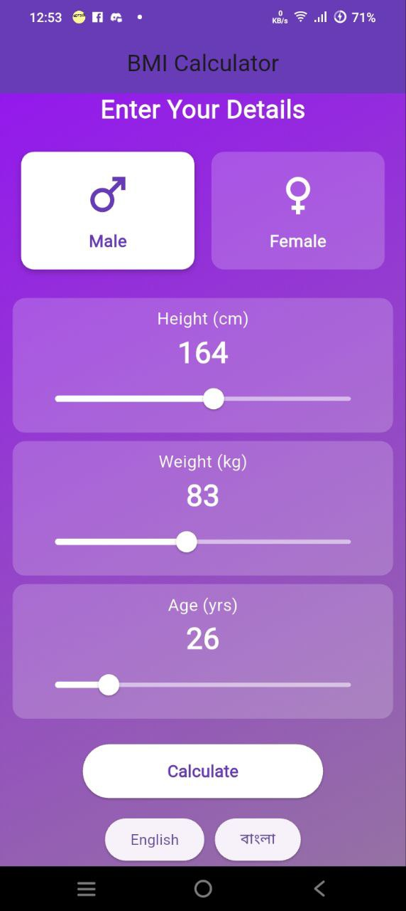

# BMI Calculator App

A Flutter-based mobile application for calculating Body Mass Index (BMI) with support for multiple languages.

## Features

- Calculate BMI based on height, weight, age, and gender
- Beautiful gradient UI with smooth animations
- Multi-language support (English and Bengali)
- BMI category classification with health advice
- Responsive design that works on various screen sizes
- Material Design components and theming

## Screenshots




## Getting Started

### Prerequisites

- Flutter SDK (latest stable version)
- Dart SDK
- An IDE (Android Studio, VS Code, etc.)
- A device or emulator to run the app

### Installation

1. Clone the repository:
   ```bash
   git clone https://github.com/yourusername/health_tracking_app.git
   ```

2. Navigate to the project directory:
   ```bash
   cd health_tracking_app
   ```

3. Install dependencies:
   ```bash
   flutter pub get
   ```

4. Run the app:
   ```bash
   flutter run
   ```

## Usage

1. Select your gender (Male/Female)
2. Adjust the height slider to your height in centimeters
3. Adjust the weight slider to your weight in kilograms
4. Adjust the age slider to your age
5. Tap the "Calculate" button to see your BMI result
6. View your BMI category and health advice
7. Change language using the buttons at the bottom (English/বাংলা)

## Technical Details

- **State Management**: Uses Flutter's built-in setState for simple state management
- **Localization**: Supports English and Bengali using Flutter's localization system
- **UI Components**:
  - Custom animated gender selection buttons
  - Sliders for numeric input
  - Alert dialog for displaying results
  - Gradient background for visual appeal

## Folder Structure

```
lib/
├── l10n/          # Localization files
├── main.dart      # Main application file
```

## Dependencies

- flutter_localizations: [latest_version] (for localization support)

# Future Work: BMI Calculator App Enhancements  

Here’s a roadmap for future improvements to make the BMI Calculator app **more intelligent, personalized, and engaging**:

---

## **📌 Core Feature Upgrades**  

### **1. Health Goal Recommendations & Tracking**  
- **Personalized Targets**: Suggest weight goals (e.g., *"Lose 5 kg in 3 months"*) based on BMI category.  
- **Progress Dashboard**: Visualize trends with charts (using `fl_chart` or `syncfusion_flutter_charts`).  
- **Local Storage**: Save user history with `shared_preferences` or `hive`.  

### **2. AI-Powered Insights**  
- **Risk Prediction**: Basic ML model (or rule-based logic) to flag potential health risks (e.g., *"High BMI may increase diabetes risk"*).  
- **Dynamic Advice**: Adjust recommendations based on age/gender (e.g., *"At 45+, focus on heart health"*).  

### **3. Visual Body Avatar**  
- **Animated Body Shape**: Show a customizable human figure that changes with BMI (e.g., underweight vs. obese).  
- **3D Render Option**: Explore `flutter_3d_obj` for a more interactive view.  

### **4. Nutrition & Fitness Integration**  
- **Meal Plans**: Suggest calorie-based diets (e.g., *"1,800 kcal/day for weight loss"*).  
- **Workout Videos**: Embed YouTube links for home exercises.  
- **API Integration**: Fetch recipes from `Edamam` or `Spoonacular`.  

---

## **📌 Technical & UX Improvements**  

### **5. Dark Mode & Themes**  
- **Toggleable Dark/Light Mode**: Using `ThemeProvider`.  
- **Custom Accent Colors**: Let users pick app colors dynamically.  

### **6. Voice & Accessibility**  
- **Voice Commands**: "Calculate BMI" via `speech_to_text`.  
- **Text-to-Speech**: Read results aloud for visually impaired users.  

### **7. Multi-User Profiles**  
- **Family Mode**: Track BMI for parents/kids separately.  
- **Guest Mode**: Quick calculations without saving data.  

### **8. Export & Share Reports**  
- **PDF Reports**: Generate summaries with `pdf` package.  
- **Social Sharing**: "Share your progress" via WhatsApp/email.  

---

## **📌 Advanced Features (Innovation)**  

| Feature | Why It Matters |  
|---------|---------------|  
| **Wearable Sync** (Google Fit/Apple Health) | Auto-import weight/height data |  
| **Smart Reminders** | "You haven’t logged BMI this week!" |  
| **Chatbot Health Assistant** | Answer questions like *"Is my BMI safe?"* |  
| **Community Challenges** | Compete with friends on fitness goals |  

---

## **📌 Localization Expansion**  
- **Add More Languages**: Hindi, Spanish, Arabic.  
- **Culturally Relevant Tips**: Diet/exercise advice tailored to regions.  

---

### **🚀 Implementation Plan**  
1. **Phase 1 (MVP+)** → Progress Tracker + Dark Mode (1-2 weeks).  
2. **Phase 2 (AI/ML)** → Risk Prediction + Dynamic Advice (3-4 weeks).  
3. **Phase 3 (Advanced)** → Wearable Sync + Chatbot (5-6 weeks).  

---

**Example Quick Win**:  
```dart
// Dark Mode Toggle (using Provider)  
Switch(  
  value: context.watch<ThemeProvider>().isDarkMode,  
  onChanged: (val) => context.read<ThemeProvider>().toggleTheme(),  
)
```  

Let me know which feature excites you most! 😊

## Contributing

Contributions are welcome! Please follow these steps:

1. Fork the project
2. Create your feature branch (`git checkout -b feature/AmazingFeature`)
3. Commit your changes (`git commit -m 'Add some amazing feature'`)
4. Push to the branch (`git push origin feature/AmazingFeature`)
5. Open a Pull Request

## License
Distributed under the MIT License. See `LICENSE` for more information.
---
## 📬 Connect with Me

**Abdullah Nazmus-Sakib**  
👨‍💻 CSE Student @ Jahangirnagar University  
🔗 [LinkedIn](https://www.linkedin.com/in/abdullah-nazmus-sakib-04024b261/)  
🐙 [GitHub](https://github.com/AbdullahRFA)

---

## Acknowledgments

- Flutter team for the amazing framework
- Material Design for UI inspiration
- Anyone whose code was used as inspiration